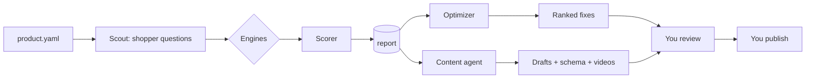

# Surfaced

**Open-source answer engine optimization (AEO) for retail sellers.** Find out where your product shows up when shoppers ask ChatGPT, Gemini, Claude, Perplexity, Amazon Rufus or Walmart Sparky, see how you rank against your competitors, and get the fixes and content that move you up.


*Screenshot uses simulated data for a fictional brand.*

## What it does

Three agents, one dashboard:

| Agent | Job |
|---|---|
| **Scorer** | Turns your product profile into the questions shoppers ask, asks every engine, and scores you against competitors (mention rate, position, top-pick rate, citations, tone, share of voice). |
| **Optimizer** | Audits your listing (title, bullets, attributes, Q&A, reviews, use-case coverage) and reads the score gaps to produce a ranked fix list, including which sources your competitors are cited from. |
| **Content agent** | Drafts blog posts, YouTube scripts, TikTok storyboards, Instagram carousels and reels, plus Product and FAQ schema, aimed at the questions you are losing. Optionally renders silent text-card videos with ffmpeg. |



## What is measured live, and what is not

Be clear-eyed about coverage. Surfaced only claims what it can actually observe.

| Engine | How Surfaced gets answers | Status |
|---|---|---|
| ChatGPT | OpenAI API with web search tool | Live, needs `OPENAI_API_KEY` |
| Claude | Anthropic API with web search tool | Live, needs `ANTHROPIC_API_KEY` |
| Gemini | Gemini API with Google Search grounding | Live, needs `GEMINI_API_KEY` |
| Perplexity | Perplexity API (Sonar) | Live, needs `PERPLEXITY_API_KEY` |
| Amazon Rufus | You capture answers and import them | Imported |
| Walmart Sparky | You capture answers and import them | Imported |

API answers approximate, but are not identical to, what a consumer sees in the app (personalization, location and product changes all matter). Rufus and Sparky have no public API and sit behind logged-in sessions, so Surfaced does **not** scrape them. Run `surfaced capture-template product.yaml rufus`, ask the assistant each question yourself, paste the answers into `captures/rufus.json`, and Surfaced scores them like any other engine. Check each marketplace's terms before using any automation of your own.

The live adapters are written against each vendor's public API docs. Vendors change model names and response formats, so if one breaks, [open an issue](../../issues) or send a fix (see `docs/EXTENDING.md`).

## Quick start (no API keys)

```bash
git clone https://github.com/YOUR-USERNAME/surfaced.git
cd surfaced
python -m venv .venv && source .venv/bin/activate     # Windows: .venv\Scripts\activate
pip install -e ".[dev]"

surfaced run examples/product.yaml --demo    # simulated engines, fictional brand
surfaced serve                               # open http://127.0.0.1:8000
```

## Use it on your own product

```bash
surfaced init                  # writes product.yaml
# edit product.yaml: your product, listing, use cases, competitors
cp .env.example .env           # add keys for the engines you want (never commit this file)

surfaced audit product.yaml    # score visibility only
surfaced optimize product.yaml # ranked fixes
surfaced content product.yaml  # drafts land in out/<product>/
surfaced run product.yaml      # all three
surfaced run product.yaml --render      # also render silent TikTok text-card videos (needs ffmpeg)
surfaced serve                 # dashboard
```

Useful flags: `--engines chatgpt,perplexity`, `--prompts 40`, `--demo`.

Set an API key for Claude, OpenAI or Gemini and the Optimizer and Content agents also write an LLM listing rewrite and polish their drafts. Without one, they use offline templates, so everything still runs.

## How the score works

Every answer is parsed for your brand and each competitor. Per answer, out of 100:

- 35 for being mentioned at all
- up to 30 for position (1st 30, 2nd 22, 3rd 15, 4th 9, later 4)
- 15 for being named the top pick
- 12 if the answer cites your site or listing
- up to plus or minus 8 for how the answer describes you

The engine score is the average over all shopper questions, and the overall score averages the engines (weights are configurable). Branded questions such as "Is Acme a good brand?" are shown but excluded from the score, since they name you by definition. Share of voice is your mentions divided by all tracked mentions.

This is a heuristic. Brand matching is by name and aliases, position is order of first mention, and tone is keyword based. Treat trends over time as more meaningful than any single number.

## Guardrails

- **Nothing is auto-posted.** Drafts go to `out/`. You review and publish from your own accounts.
- **No invented facts.** Content uses only your product profile. Unknowns become `[VERIFY: ...]` markers, and FAQ answers with a marker are left out of generated schema.
- **Disclosure is built in.** Drafts state that the brand created them.
- **No fake reviews, sockpuppets or scraping behind logins.** Recommendations that involve communities or reviews say to disclose your affiliation and follow platform rules.
- **The server has no authentication.** `surfaced serve` binds to `127.0.0.1`. Do not expose it to the internet without putting auth in front.

## Fork it and make it yours

1. **Fork.** Click **Fork** at the top right of this repository on GitHub, or run `gh repo fork OWNER/surfaced --clone`.
2. **Clone your fork** and follow the quick start above.
3. **Configure.** Copy `.env.example` to `.env`, add the keys you have, and edit `product.yaml`.
4. **Run.** `surfaced run product.yaml`, then `surfaced serve`.
5. **Stay current.**
   ```bash
   git remote add upstream https://github.com/OWNER/surfaced.git
   git fetch upstream && git merge upstream/main
   ```
6. **Optional: host the static demo dashboard** on your fork. Go to Settings, Pages, Source, choose GitHub Actions. The included `pages.yml` deploys `ui/` whenever it changes. The hosted page shows the bundled sample data only; live data needs `surfaced serve` on your machine or a server you control.
7. **Optional: Docker.** `docker build -t surfaced .` then `docker run -p 8000:8000 -v $PWD/product.yaml:/app/product.yaml --env-file .env surfaced`.

Replace `OWNER` and `YOUR-USERNAME` with the real GitHub usernames.

Want to contribute back? See [CONTRIBUTING.md](CONTRIBUTING.md) and [docs/EXTENDING.md](docs/EXTENDING.md).

## Project layout

```
surfaced/
  engines/      live adapters, marketplace imports, demo engines
  agents/       scorer.py, optimizer.py, content.py
  render/       ffmpeg text-card video renderer
  extract.py    answer parsing and per-answer scoring
  pipeline.py   runs the agents and saves data/state.json
  server.py     FastAPI: serves ui/ and /api
  cli.py        the `surfaced` command
ui/index.html   the dashboard (single file, works standalone with sample data)
examples/       fictional example product
tests/          pytest suite
```

## Known limitations

- Answers from APIs differ from consumer apps, and answers vary run to run. Use enough questions and re-run over time.
- Rufus and Sparky scores depend on answers you capture by hand.
- Name matching can miss unusual brand spellings (add `brand_aliases`) and cannot read product images.
- Video output is a silent text-card slideshow. Add voiceover, or plug in a generation service (`docs/EXTENDING.md`).
- Recommendations are best-practice heuristics, not guarantees of ranking.

